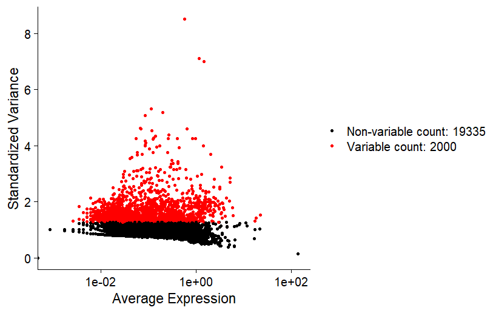
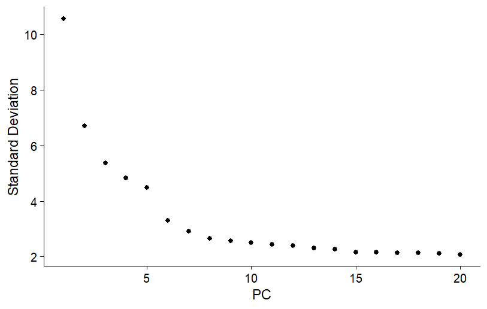
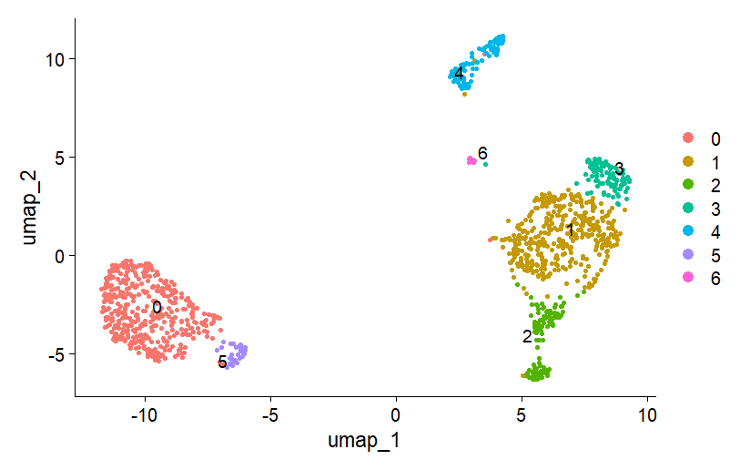
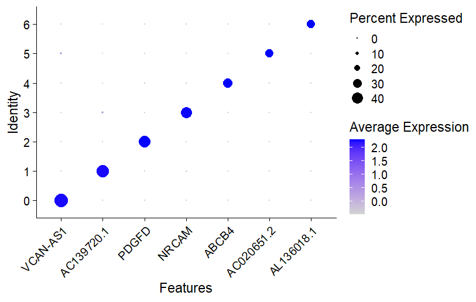
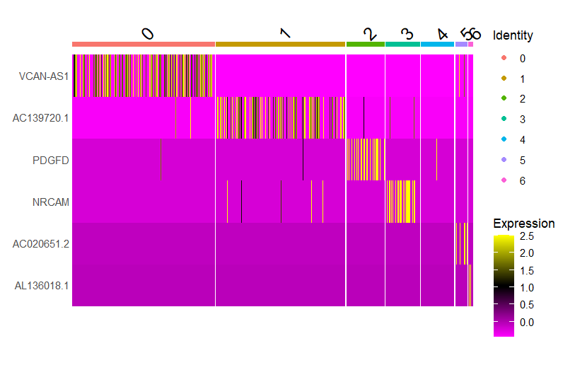
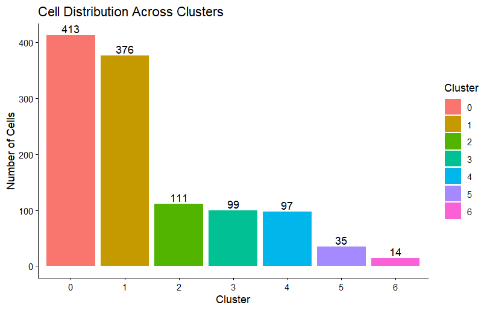

# single-cell-breast-cancer-gse131907-
Single-cell RNA-seq analysis of the breast cancer dataset GSE131907 using Seurat, including quality control, clustering, and transcriptomic visualization.

## Overview

This repository contains a single-cell RNA sequencing (scRNA-seq) analysis workflow applied to the **GSE131907 breast cancer dataset**.
The objective of the analysis is to explore transcriptional heterogeneity across individual cells and identify distinct cellular clusters within the tumor microenvironment.

The workflow includes standard scRNA-seq processing steps such as:

* Quality control filtering
* Data normalization
* Identification of highly variable genes
* Dimensionality reduction using PCA
* Cell clustering
* UMAP visualization
* Gene expression visualization using DotPlot and Heatmap

This project demonstrates the application of single-cell transcriptomic analysis using the Seurat package in R.

---

# Dataset

Dataset used in this analysis:

**GSE131907 – Breast Cancer Single-Cell RNA-seq Dataset**

Source: Gene Expression Omnibus (GEO)

The dataset contains single-cell transcriptomic profiles derived from breast cancer tissues, enabling exploration of cell population diversity and gene expression variability across cells.

Dataset link:

https://www.ncbi.nlm.nih.gov/geo/query/acc.cgi?acc=GSE131907

---

# Analysis Workflow

The overall analysis pipeline is illustrated below.

```
Raw scRNA-seq Data
        │
        ▼
Quality Control Filtering
        │
        ▼
Data Normalization
        │
        ▼
Highly Variable Gene Detection
        │
        ▼
Principal Component Analysis (PCA)
        │
        ▼
Cell Clustering
        │
        ▼
UMAP Visualization
        │
        ▼
Gene Expression Visualization
(DotPlot and Heatmap)
```

---

# Repository Structure

```
breast-cancer-scrnaseq-gse131907/

│
├── README.md
│
├── scripts/
│   └── scrnaseq_analysis_GSE131907.R
│
├── data/
│   └── raw/
│
├── results/
│   └── figures/
│        qc_violin_plot.png
│        variable_genes_plot.png
│        pca_elbow_plot.png
│        umap_clusters.png
│        dotplot_marker_genes.png
│        heatmap_marker_genes.png
│        cluster_composition.png
│
└── report/
    short_report.pdf
```

---

# Software Requirements

The analysis was conducted using **R** with the following packages:

* Seurat
* ggplot2
* dplyr
* patchwork

Install required packages:

```r
install.packages(c("Seurat","ggplot2","dplyr","patchwork"))
```

---

# Running the Analysis

Clone the repository:

```
git clone https://github.com/yourusername/breast-cancer-scrnaseq-gse131907.git
```

Open R and run the analysis script:

```r
source("scripts/scrnaseq_analysis_GSE131907.R")
```

The script performs the full pipeline including:

* data preprocessing
* dimensionality reduction
* clustering
* visualization

All generated figures will be saved in:

```
results/figures/
```

---

# Results and Visualizations

## Quality Control Metrics

Quality control filtering was performed to remove low-quality cells based on gene counts and mitochondrial gene percentage.


---

## Highly Variable Genes

Highly variable genes were identified to capture genes contributing the most to cell-to-cell transcriptional variability.



---

## PCA Elbow Plot

Principal component analysis was used to reduce dimensionality and determine the number of informative principal components.



---

## UMAP Clustering

UMAP visualization shows clustering of cells based on transcriptomic similarity.



---

## DotPlot of Gene Expression

DotPlot visualization displays the expression patterns of selected genes across clusters.



---

## Heatmap of Gene Expression

Heatmap visualization highlights gene expression differences across clusters.



---

## Cluster Composition

Cluster composition illustrates the distribution of cells across identified clusters.



---

# Report

A brief report summarizing the analysis and results is available in:

```
report/breast_cancer_scrnaseq_report.pdf
```

---

# License

This repository is released for educational and research purposes.

---

# Author

Bioinformatics analysis project using single-cell RNA sequencing data.
